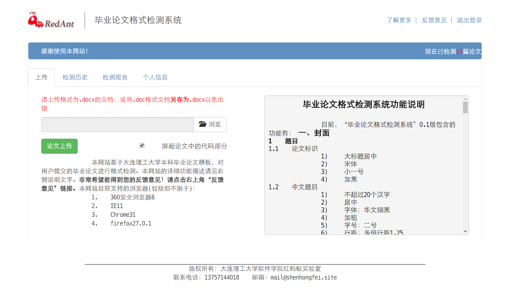
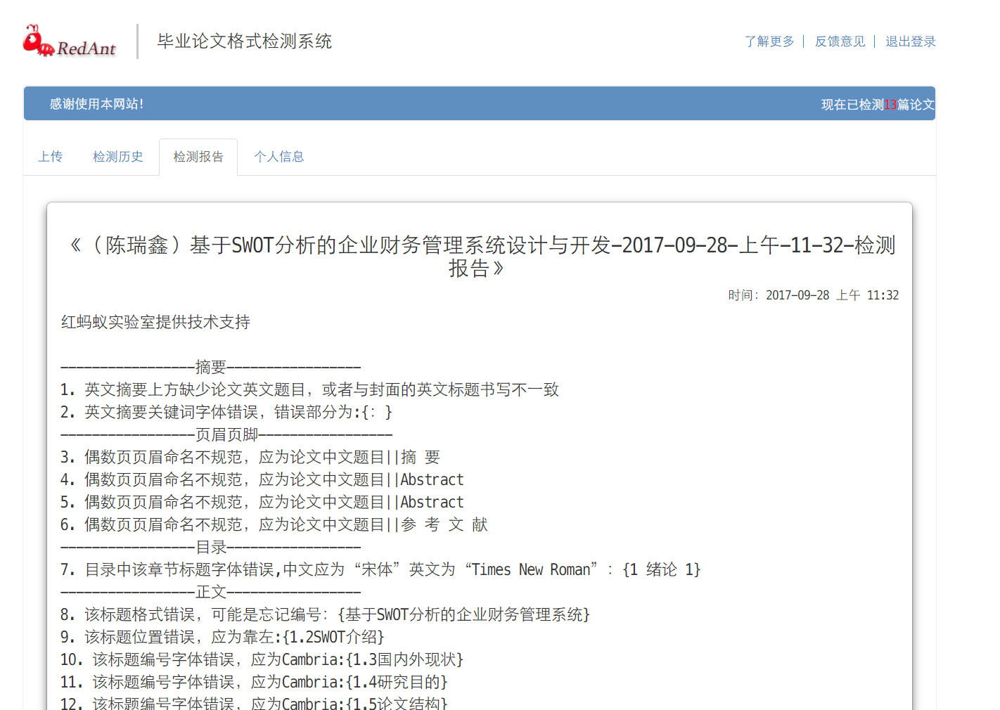

# 论文检测网站

## 使用说明

内网

<http://210.30.97.53/PaperDetect>

外网

<http://1669y0b369.imwork.net/PaperDetect>

测试学生：

账号：21412345

密码：123123

#### 预览





教师界面


## 运行方法

1.  下载构建好的压缩包 [https://github.com/ShenHongFei/PD/releases/download/stable/PaperDetect-2017-10-12.zip](https://github.com/ShenHongFei/PD/releases/download/stable/PaperDetect-2017-10-12.zip)
2.  解压至英文、无空格目录（本地应用不支持）
3.  运行 `run-8080-port.ps1` (Y允许执行) 或者 在终端中执行 `java -jar -Dfile.encoding=UTF-8 -Dserver.port=8080 PD.jar`
4.  打开网页 [http://localhost:8080/PaperDetect](http://localhost:8080/PaperDetect)
5.  注册学生账号后即可上传论文检测

## 开发指南

#### 构建项目

make-release.ps1

```powershell
e:
cd E:\SDK\PD\
ls

# 单机程序编译后添加运行依赖（资源文件）
    cd E:\SDK\PD\app\postgraduate\PaperFormatDetection
    ls .\bin\Debug
    ls .\res
    copy .\res\* .\bin\Debug\

# 测试单机程序
    cd .\bin\Debug\
    # 研究生命令行
    chcp 936
    E:\SDK\PD\app\postgraduate\PaperFormatDetection\bin\Debug\PaperFormatDetection.exe E:\SDK\PD\app\postgraduate\PaperFormatDetection\bin\Debug\temp.docx E:\SDK\PD\test-papers\post-graduate\（陈瑞鑫）基于SWOT分析的企业财务管理系统设计与开发.docx false 1 false
    chcp 65001
    # 查看报告
    ls .\Papers -Recurse
    
    # 清理测试
    rm .\Templates,.\Papers -Recurse
  

# 构建并打包
    cd E:\SDK\PD\
    ls release
    # 构建 后端jar包
        .\gradlew.bat bootrepackage

    # 复制
        mkdir .\release -ErrorAction SilentlyContinue
        cp run-*.ps1 .\release
        cp .\教师账号.txt .\release
        cp .\build\libs\PD.jar .\release
        cp .\web .\release  -Recurse -Force
        mkdir .\release\app\postgraduate\PaperFormatDetection\bin\ -ErrorAction SilentlyContinue
        cp .\app\postgraduate\PaperFormatDetection\bin\Debug .\release\app\postgraduate\PaperFormatDetection\bin\Debug -Recurse -Force

    # 检查
        ls .\release
        ls .\release\web\
        ls .\release\app\postgraduate\PaperFormatDetection\bin\Debug\

    # 打包
        Add-Type -AssemblyName "System.IO.Compression.FileSystem"
        [IO.Compression.ZipFile]::CreateFromDirectory("$PWD\release","$pwd\PaperDetect-2017-10-12.zip")

    # 清理
        rm PaperDetect-*.zip
        rm .\release -Recurse
```

